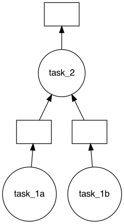

# Getting Started

## Register Tasks
You can register any arbitrary Python function as a task by using the task decorator.


```python
import daglib

dag = daglib.Dag()


@dag.task()
def task():
    return 1
```

## Returning Values

To return values, you must mark one or more tasks as `final`. This tells the orchestration engine what to return. The tasks in the graph will not be computed/ran unless there is at least one task marked as `final`. So if you have tasks that do not return values you should still mark the last one as `final` to ensure that the tasks run.


```python
import daglib

dag = daglib.Dag()


@dag.task()
def task():
    return 1


# will return empty tuple
dag.run()
```


    ()


```python
import daglib

dag = daglib.Dag()


@dag.task(final=True)
def task():
    return 1


# Will return 1
dag.run()
```


    1


You can specify multiple return values by marking more than one task as final. The result from the DAG run will be a tuple of all results.


```python
import daglib

dag = daglib.Dag()


@dag.task(final=True)
def task_1():
    return 6


@dag.task(final=True)
def task_2():
    return 3


dag.run()
```


    (6, 3)


You can still run tasks that do not return anything (this can be useful for tasks that write data to storage, log something, etc.). The return type of `dag.run()` will be `None`.


```python
import daglib

dag = daglib.Dag()


@dag.task(final=True)
def task_1():
    print("This returns nothing!")


dag.run()
```

    This returns nothing!


## Task I/O

daglib supports passing the output(s) of one task as an input to another. You can pass the output of one task to another by adding the name of the task as an argument in the descendant task.


```python
import daglib

dag = daglib.Dag()


@dag.task()
def task_1():
    return 6


@dag.task(final=True)
def task_2(task_1):
    return task_1 * 3


dag.run()
```


    18


A task can also take the outputs of multiple tasks as inputs


```python
import daglib

dag = daglib.Dag()


@dag.task()
def task_1a():
    return 6


@dag.task()
def task_1b():
    return 3


@dag.task(final=True)
def task_2(task_1a, task_1b):
    return task_1a * task_1b


dag.run()
```


    18


## Visualizing the DAG

To visualize the task graph being computed, you can call `visualize()` on the DAG object. Please note that you need to have `graphviz` installed.


```python
import daglib

dag = daglib.Dag()


@dag.task()
def task_1a():
    return 6


@dag.task()
def task_1b():
    return 3


@dag.task(final=True)
def task_2(task_1a, task_1b):
    return task_1a * task_1b


dag.visualize()
```



