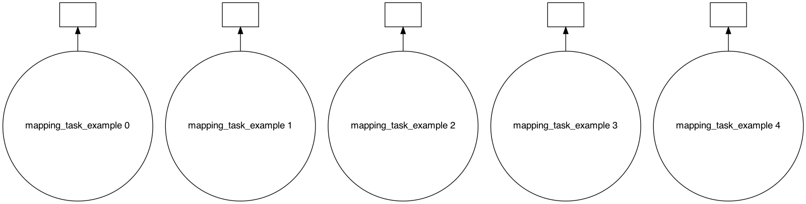
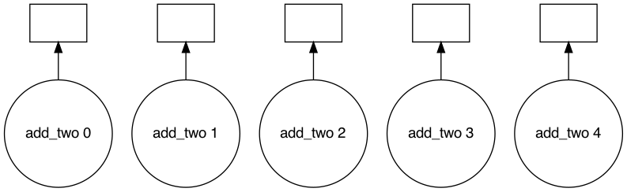
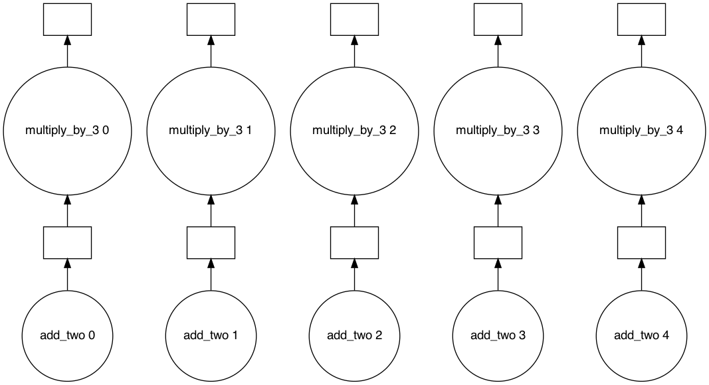
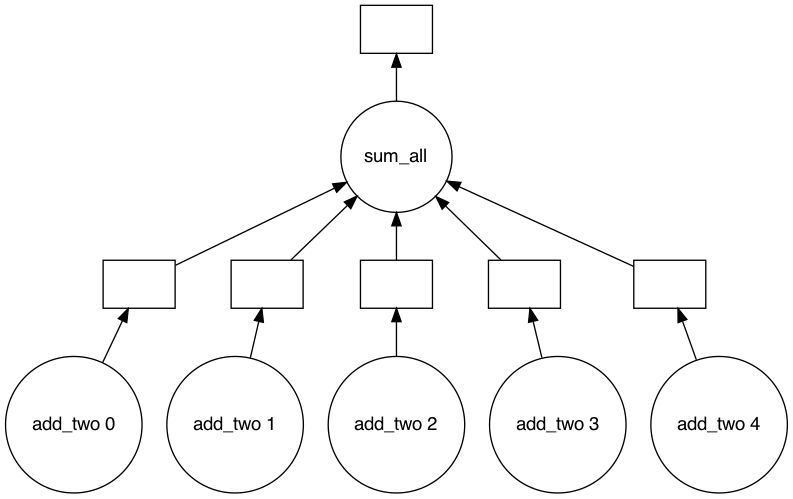
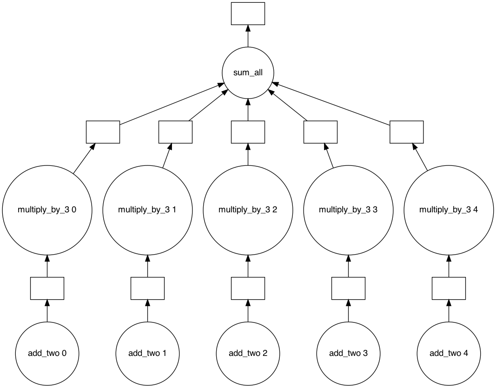
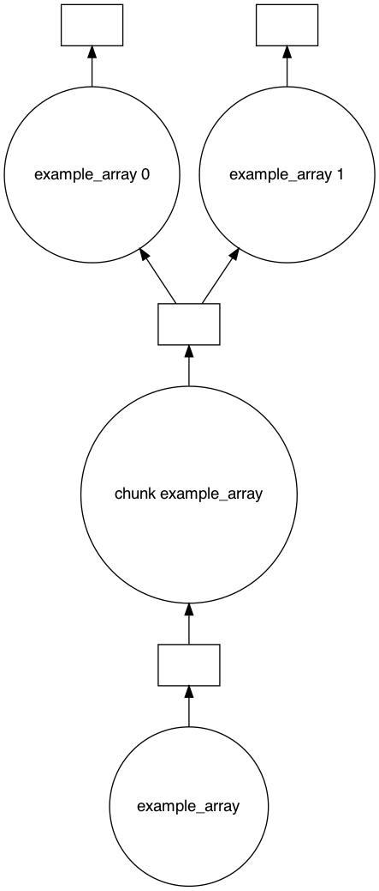
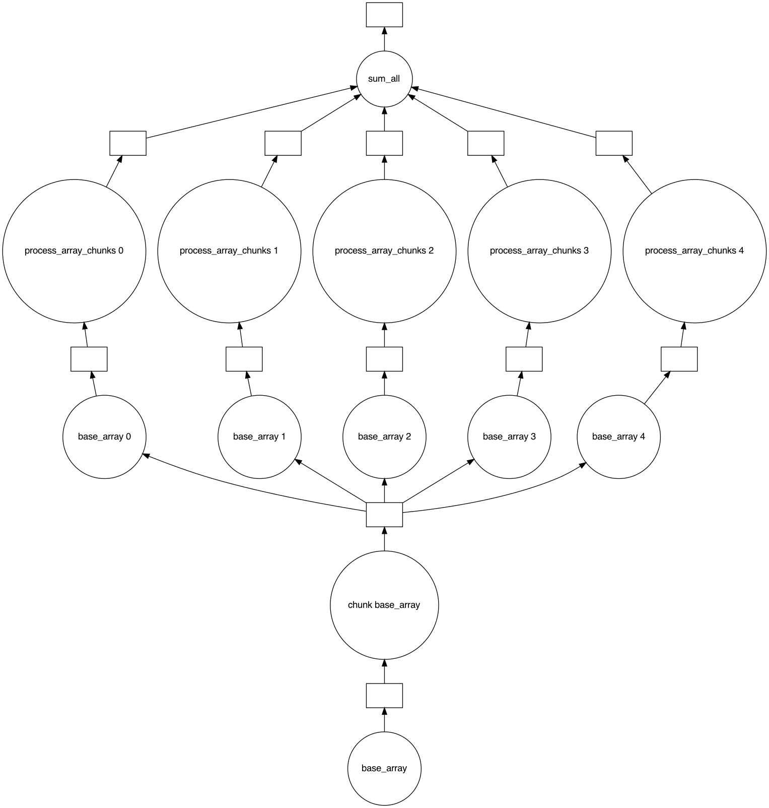

# Types of Tasks

We've already seen the most basic type of task we can register, one that just wraps around an arbitrary function like the one below:


```python
import daglib

dag = daglib.Dag()


@dag.task()
def task_1():
    print("This is task 1")
```

There are other special types of tasks that you can create such as:

- Mapping tasks
- Joining tasks
- Chunked tasks

## Mapping tasks

Mapping tasks are dynamically generated from either a static iterable, or from the output of another task that returns an iterable.

### Mapping task from static iterable


```python
import daglib

dag = daglib.Dag()


@dag.task(map_to=[1, 2, 3, 4, 5], final=True)
def mapping_task_example(n):
    """Note that the print statements may not be linear since tasks are run in parallel"""
    print(f"mapping_task_example function running for {n}")


dag.run()
```

    mapping_task_example function running for 1mapping_task_example function running for 2
    mapping_task_example function running for 3
    mapping_task_example function running for 4
    mapping_task_example function running for 5
    


    (None, None, None, None, None)


```python
dag.visualize()
```


    

    


```python
import daglib

dag = daglib.Dag()


@dag.task(map_to=[1, 2, 3, 4, 5], final=True)
def add_two(n):
    return n + 2


dag.run()
```


    (3, 4, 5, 6, 7)


```python
dag.visualize()
```


    

    


### Mapping task from the output of another task

Note that the value passed to `map_to` must match the function name of the task to map to.


```python
import daglib

dag = daglib.Dag()


@dag.task(map_to=[1, 2, 3, 4, 5])
def add_two(n):
    return n + 2


@dag.task(map_to="add_two", final=True)
def multiply_by_3(n):
    return n * 3


dag.run()
```


    (9, 12, 15, 18, 21)


```python
dag.visualize()
```


    

    


## Joining tasks

When you want to condense dynamically generated tasks, likes one created by using the `map_to` argument, or ones created from `result_chunks` argument which we'll see in a little, you'll want to use joining tasks.


```python
import daglib

dag = daglib.Dag()


@dag.task(map_to=[1, 2, 3, 4, 5])
def add_two(n):
    return n + 2


@dag.task(joins="add_two", final=True)
def sum_all(*tasks):
    return sum(tasks)


dag.run()
```


    25


```python
dag.visualize()
```


    

    


```python
import daglib

dag = daglib.Dag()


@dag.task(map_to=[1, 2, 3, 4, 5])
def add_two(n):
    return n + 2


@dag.task(map_to="add_two", final=True)
def multiply_by_3(n):
    return n * 3


@dag.task(joins="multiply_by_3", final=True)
def sum_all(*tasks):
    return sum(tasks)


dag.run()
```


    (9, 12, 15, 18, 21, 75)


```python
dag.visualize()
```


    

    


## Chunked tasks

We've seen how to dynamically spawn tasks from an iterable using `map_to`, but in some cases, you'll want to break up the single result of a task into multiple chunks, so you can operate on them in parallel.

**Note**: The return type of a chunked task must be iterable.


```python
import daglib

dag = daglib.Dag()


@dag.task(result_chunks=2, final=True)
def example_array():
    return [1, 2, 3, 4, 5, 6, 7, 8, 9, 10]


dag.run()
```


    ([1, 2, 3, 4, 5], [6, 7, 8, 9, 10])


```python
dag.visualize()
```


    

    


In the task graph, you can see an extra step be generated called `chunk example_array`. This step takes whatever task has been specified as a chunked task and breaks it up into N-number of chunks (the chunks are not guaranteed to be of the same length, see [numpy.array_split](https://numpy.org/doc/stable/reference/generated/numpy.array_split.html) for more info).

## Putting it all together

To start composing more complex workflows, interweaving these task types can produce surprisingly intricate task graphs without much code.


```python
import itertools

import daglib

dag = daglib.Dag()


@dag.task(result_chunks=5)
def base_array():
    return [n for n in range(100)]


@dag.task(map_to="base_array")
def process_array_chunks(chunk):
    return [n * 2 for n in chunk]


@dag.task(joins="process_array_chunks", final=True)
def sum_all(*chunks):
    return sum(itertools.chain.from_iterable(chunks))

dag.run()
```


    9900


```python
dag.visualize()
```


    

    


```python

```
