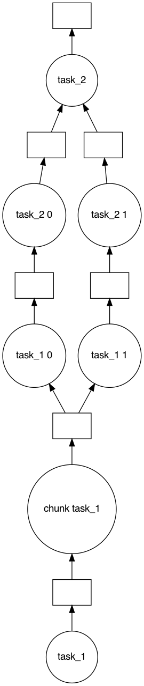
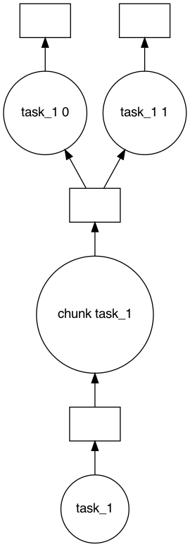
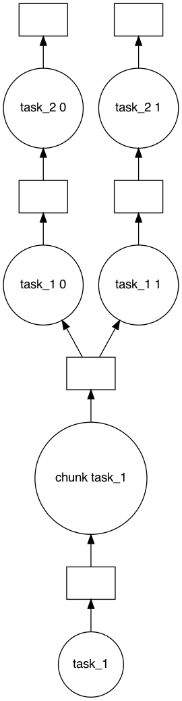
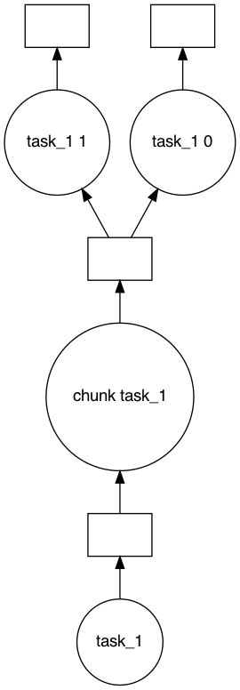
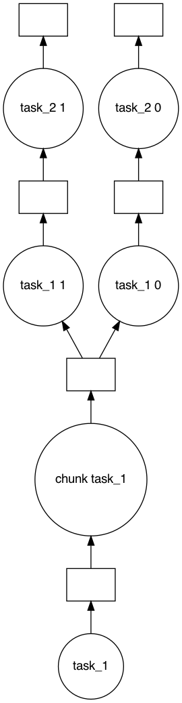

# Testing

One of the great things about daglib is how simple it is to create unit tests. No mocking, no fixtures, etc. required. Since the tasks are defined as normal Python functions, they can be tested normally too.


```python
import daglib

dag = daglib.Dag()


@dag.task()
def task_1():
    return [1, 2, 3, 4, 5]


@dag.task(final=True)
def task_2(task_1):
    return [n * 2 for n in task_1]
```


```python
def test_task_2():
    assert task_2([1, 2, 3]) == [2, 4, 6]


test_task_2()
```

## To Step

You can also specify a "to step" that the DAG should run to and then stop. This is helpful for debugging purposes.


```python
import daglib

dag = daglib.Dag()


@dag.task()
def task_1():
    return [1, 2, 3, 4, 5]


@dag.task(final=True)
def task_2(task_1):
    return [n * 2 for n in task_1]
```


```python
dag.run(to_step="task_1")
```


    [1, 2, 3, 4, 5]


```python
# You can also pass the uncalled task
dag.run(to_step=task_1)
```


    [1, 2, 3, 4, 5]


This will also work with mapping or chunked tasks


```python
from itertools import chain

import daglib

dag = daglib.Dag()


@dag.task(result_chunks=2)
def task_1():
    return [1, 2, 3, 4, 5, 6]


@dag.task(map_to=task_1)
def task_2(task_1):
    return [n * 2 for n in task_1]


@dag.task(joins=task_2, final=True)
def task_2(*mapped_tasks):
    return sum(chain.from_iterable(mapped_tasks))
```


```python
dag.run()
```


    42


```python
dag.visualize()
```


    

    


```python
dag.run(to_step=task_1)
```


    ([1, 2, 3], [4, 5, 6])


```python
dag.visualize(to_step=task_1)
```


    

    


```python
dag.run(to_step=task_2)
```


    ([2, 4, 6], [8, 10, 12])


```python
dag.visualize(to_step=task_2)
```


    

    


```python

```

## To Step

You can also specify a "to step" that the DAG should run to and then stop. This is helpful for debugging purposes.


```python
import daglib

dag = daglib.Dag()


@dag.task()
def task_1():
    return [1, 2, 3, 4, 5]


@dag.task(final=True)
def task_2(task_1):
    return [n * 2 for n in task_1]
```


```python
dag.run(to_step="task_1")
```


    [1, 2, 3, 4, 5]


```python
# You can also pass the uncalled task
dag.run(to_step=task_1)
```


    [1, 2, 3, 4, 5]


This will also work with mapping or chunked tasks


```python
from itertools import chain

import daglib

dag = daglib.Dag()


@dag.task(result_chunks=2)
def task_1():
    return [1, 2, 3, 4, 5, 6]


@dag.task(map_to=task_1)
def task_2(task_1):
    return [n * 2 for n in task_1]


@dag.task(joins=task_2, final=True)
def task_2(*mapped_tasks):
    return sum(chain.from_iterable(mapped_tasks))
```


```python
dag.run()
```


    42


```python
dag.visualize()
```


    

    


```python
dag.run(to_step=task_1)
```


    ([1, 2, 3], [4, 5, 6])


```python
dag.visualize(to_step=task_1)
```


    

    


```python
dag.run(to_step=task_2)
```


    ([2, 4, 6], [8, 10, 12])


```python
dag.visualize(to_step=task_2)
```


    

    


```python

```
