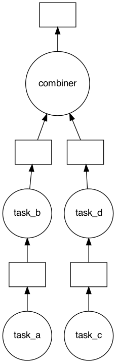

# Building Larger Projects

When creating larger projects and DAGs it can be helpful to separate out workflows into different files and then combining the DAGs into one larger DAG.


```python
import daglib
```


```python
subdag1 = daglib.Dag()


@subdag1.task()
def task_a():
    return [1, 2, 3, 4, 5]


@subdag1.task(final=True)
def task_b(task_a):
    return [n ** 2 for n in task_a]


subdag1.run()
```


    [1, 4, 9, 16, 25]


```python
subdag2 = daglib.Dag()


@subdag2.task()
def task_c():
    return [6, 7, 8, 9, 10]


@subdag2.task(final=True)
def task_d(task_c):
    return [n ** 2 for n in task_c]


subdag2.run()
```


    [36, 49, 64, 81, 100]


```python
dag = daglib.Dag()
dag.add_subdag(subdag1)
dag.add_subdag(subdag2)


@dag.task(depends_on=[*subdag1.final_tasks, *subdag2.final_tasks], final=True)
def combiner(*tasks):
    from itertools import chain
    return sum(list(chain.from_iterable(tasks)))


dag.run()
```


    385


```python
dag.visualize()
```


    

    


In the example above, when we add the subdags, we do not keep their final task outputs as final outputs for the combined DAG. If we did, the result of `dag.run()` would have been a tuple containing the outputs of `task_b`, `task_d`, `combiner`. For this example we just wanted the final output of `combiner`. If we did want to keep the finals we can do the following:


```python
import daglib
```


```python
subdag1 = daglib.Dag()


@subdag1.task()
def task_a():
    return [1, 2, 3, 4, 5]


@subdag1.task(final=True)
def task_b(task_a):
    return [n ** 2 for n in task_a]


subdag1.run()
```


    [1, 4, 9, 16, 25]


```python
subdag2 = daglib.Dag()


@subdag2.task()
def task_c():
    return [6, 7, 8, 9, 10]


@subdag2.task(final=True)
def task_d(task_c):
    return [n ** 2 for n in task_c]


subdag2.run()
```


    [36, 49, 64, 81, 100]


```python
dag = daglib.Dag()
dag.add_subdag(subdag1, keep_finals=True)
dag.add_subdag(subdag2, keep_finals=True)


@dag.task(depends_on=[*subdag1.final_tasks, *subdag2.final_tasks], final=True)
def combiner(*tasks):
    from itertools import chain
    return sum(list(chain.from_iterable(tasks)))


output_of_subdag1, output_of_subdag2, output_of_dag = dag.run()

print(output_of_subdag1)
print(output_of_subdag2)
print(output_of_dag)
```

    [1, 4, 9, 16, 25]
    [36, 49, 64, 81, 100]
    385


```python
dag.visualize()
```


    

    


